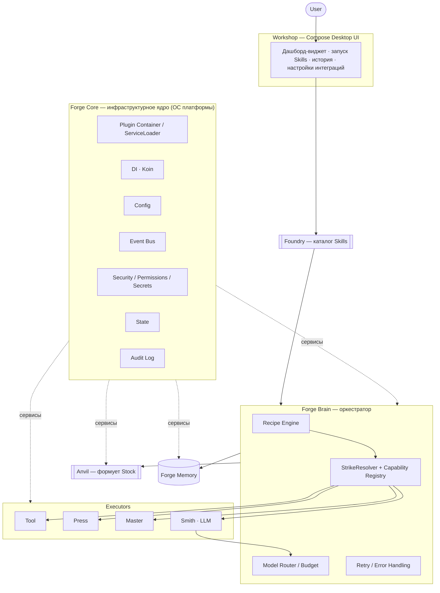
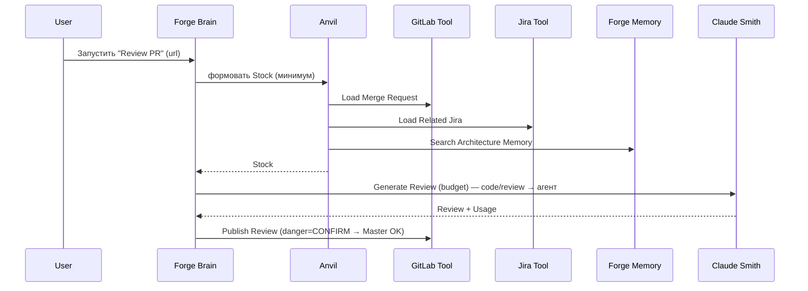

# The Forge — Архитектура (v1.1, реконсиленная)

> Инженерная платформа, где LLM не видно: пользователь запускает **Skills**, а платформа сама
> собирает контекст, выбирает исполнителя и экономит токены.
> Стек: **Kotlin + Compose Multiplatform Desktop** (Windows + macOS + Linux).
> Статус: движок (P0–P1) реализован и покрыт тестами; дальше по фазам.

Исходное ТЗ v1.0 частично сгенерировано и переусложнено — этот документ выровнен под 4 реальных
требования владельца (виджет-фичи, экономия токенов, безопасные интеграции, GitHub) и утверждённый план.

---

## 0. Словарь кузницы

| Роль | Имя | В кузнице |
|---|---|---|
| Атомарный шаг | **Strike** | удар молота |
| Процесс Skill | **Recipe** | рецепт ковки (DAG из Strike'ов) |
| Собранный контекст | **Stock** | заготовка, которую формует Anvil |
| Исполнитель — детерминизм | **Tool** | инструмент |
| Исполнитель — лок. программа | **Press** | пресс |
| Исполнитель — человек | **Master** | мастер-кузнец |
| Исполнитель — LLM | **Smith** | кузнец |

Без изменений: The Forge, Forge Core/Brain/Memory, Workshop, Foundry, Anvil, Skill, Forge SDK.
Лестница Automation First: **Tool → Press → Master → Smith**.

---

## 1. Принципы → механизмы

| Принцип | Механизм |
|---|---|
| **Skill First** | Workshop не имеет кнопок «модель/промпт» — только запуск Skill из Foundry |
| **AI Invisible** | Smith спрятан за `ExecutorProvider`-SPI; пользователь видит Strike, не модель |
| **Context Native** | Каждый Strike объявляет, что нужно; Anvil формует `Stock` до выполнения |
| **Workflow Driven** | Skill = декларация; исполнение = интерпретация `Recipe` из `Strike`-ов |
| **Automation First** | Приоритет `Tool > Press > Master > Smith` зашит как `ExecutorKind.order` |
| **Everything is a Plugin** | Всё грузится через `ServiceLoader`; ядро не знает конкретики |
| **Диспетчеризация, не RAG** | Знания/память доступны как вызываемые Skills, а не векторный стаффинг в промпт |

---

## 2. Архитектура (с Forge Core)



Forge Core — фундамент; Brain, Anvil, Memory, Executors — сервисы поверх него.

---

## 3. Модульная структура (Gradle multi-module)

```
the-forge/
├── forge-sdk/           # [реализовано] публичные контракты, нулевые зависимости
├── forge-brain/         # [реализовано, частично] StrikeResolver + Capability Registry
├── forge-core/          # ядро: PluginContainer, DI, Config, EventBus, Security, State, Audit
├── forge-anvil/         # формовка Stock + встроенные ContextProvider'ы
├── forge-memory/        # MemoryProvider SPI + хранилище (доступ через memory-Skills, не RAG)
├── forge-executors/     # рантаймы Tool/Press/Master/Smith
├── plugins/
│   ├── integration-git/          # Tool + ContextProvider
│   ├── integration-gitlab/       # Tool (БЕЗ merge/force-push)
│   ├── integration-jira/         # Tool
│   ├── integration-confluence/   # Tool
│   ├── integration-grafana/      # Tool (read-only: метрики/алерты)
│   ├── smith-qwen/               # Smith — локальная LLM (текст/планирование)
│   └── smith-claude-code/        # Smith — агент (код/ревью)
├── skills/              # виджет-Skills (create-jira, open-mr, dashboard) + AI-Skills (review-pr, ...)
└── forge-workshop/      # Compose Desktop приложение
```

**Правило зависимостей:** всё зависит только от `forge-sdk`. Плагины не зависят от ядра — лишь от SDK.

---

## 4. Контракты Forge SDK (реализованные сигнатуры)

### 4.1 Домен Skill / Recipe / Strike
```kotlin
interface Skill { val id: SkillId; val title: String; val recipe: Recipe; /* inputs, output */ }

data class Recipe(val id: RecipeId, val strikes: List<StrikeDecl>,
                  val edges: List<RecipeEdge> = linear(strikes))     // DAG с самого начала (Q4)

data class StrikeDecl(                                                // ДЕКЛАРАТИВЕН: ЧТО, не КАК
    val id: StrikeId,
    val capability: CapabilityId,                                    // "vcs.open-merge-request"
    val danger: DangerLevel = SAFE,                                 // SAFE | CONFIRM | FORBIDDEN
    val versionConstraint: VersionConstraint = AnyVersion,
    val input: Map<String, Any?> = emptyMap(),
)
```

### 4.2 Capability + Executor (сердце движка)
```kotlin
enum class ExecutorKind(val order: Int) { TOOL(0), PRESS(1), MASTER(2), SMITH(3) }  // Automation First

data class Capability(val id: CapabilityId, val version: SemVer = SemVer(1,0,0),
                      val input: TypeRef = TypeRef.ANY, val output: TypeRef = TypeRef.ANY)

interface ExecutorProvider {
    val id: ProviderId
    val kind: ExecutorKind
    val capabilities: Set<Capability>
    val priority: Int get() = 0
    fun canHandle(strike: StrikeDecl, stock: Stock): Boolean = true  // false → падение к сл. тиру
    suspend fun execute(strike: StrikeDecl, stock: Stock): StrikeResult
}
```

### 4.3 Smith — единый контракт (CLI-агент И API)
```kotlin
interface Smith : ExecutorProvider {           // kind = SMITH
    val model: ModelId                          // "qwen", "claude-code", ...
    suspend fun run(task: SmithTask, stock: Stock, budget: Budget): SmithResult  // usage → аудит/бюджет
}
// CliAgentSmith (процесс: claude/…) и ApiSmith (HTTP) — обе за одним контрактом.
// «CLI vs API» = выбор реализации, не изменение контракта.
```

### 4.4 Context / Memory / Validator SPI
```kotlin
interface ContextProvider { val source: ContextSource; suspend fun collect(req: ContextRequest): ContextFragment }
interface MemoryProvider  { suspend fun store(e: MemoryEntry); suspend fun retrieve(q: MemoryQuery): List<MemoryEntry> }
interface Validator       { fun validate(strike: StrikeDecl, result: StrikeResult, stock: Stock): ValidationVerdict }
```

---

## 5. Ключевые механизмы

### 5.1 Разрешение Strike → Executor (реализовано)
```
fun resolve(strike, stock):
    if strike.danger == FORBIDDEN || registry.isForbidden(cap): return Forbidden
    candidates = registry.providersFor(cap)
        .filter { satisfiesVersion(it, strike) }.filter { it.canHandle(strike, stock) }
    if candidates.isEmpty(): return NoExecutor(cap)
    chosen = candidates.minWith(compareBy({ kind.order }, { -priority }, { id.value }))  // детерминизм
    return Selected(chosen, requiresConfirmation = strike.danger == CONFIRM)
```
«Automation First» = `kind.order`: Smith выбирается, только если ни Tool, ни Press, ни Master не подходят.
Forbidden — двойная защита: запрещённая capability не проходит `register()` И не резолвится.
Покрыто 15-кейсовой тест-матрицей (`StrikeResolverTest`), все зелёные.

### 5.2 Anvil, Stock и диспетчеризация вместо RAG
- Strike объявляет, что нужно — Anvil формует **минимальный Stock** (лениво, параллельно), без «сбора всего».
- Тяжёлые знания модель **дотягивает вызовами Skills** (`Load Merge Request`, `Search Architecture Decision`), а не через предзагруженный дамп в промпт.
- Forge Memory — структурированное хранилище, доступ через memory-Skills; семантический поиск (если понадобится) — отдельный опциональный Tool, не RAG по умолчанию.

### 5.3 Цикл исполнения Forge Brain
```
RESOLVE → COLLECT_STOCK → CHECK_PERMISSIONS → EXECUTE → VALIDATE → COMMIT
             (Anvil)         (Security)                   (Validator)  (State+Audit)
   ошибка → RETRY | FALLBACK | MASTER | FAIL
```
Контроль стоимости: перед `EXECUTE` Smith'а Model Router выдаёт `Budget`; после — `Usage` в аудит.

### 5.4 Model Router — экономия токенов (роль-роутинг)
| Класс задачи | Исполнитель |
|---|---|
| Продумывание/формулировка текста задачи, планирование Recipe, классификация, суммаризация | **Qwen** (локальная LLM) |
| **Написание кода и ревью** | **Claude Code** (агент) |

Эскалация от локальной LLM к агенту — при провале Validator. Бюджет на запуск Skill; превышение → политика.

### 5.5 Безопасность
- Permissions на плагин (сеть/ФС/exec/секреты) — Core выдаёт только заявленное.
- Секреты — в системном хранилище (Windows Credential Manager / macOS Keychain), не plaintext.
- Опасные Strike (`CONFIRM`): запись во внешние системы → подтверждение Master.
- Жёсткие запреты (`FORBIDDEN`): GitLab merge / force-push — capability не существует и не регистрируется.

---

## 6. Сквозной сценарий: `Review Pull Request`


`load-merge-request` резолвится в GitLab Tool (kind=TOOL); `generate-review` не имеет Tool/Press → Smith.

---

## 7. Технологический стек

| Слой | Выбор |
|---|---|
| Язык / рантайм | **Kotlin 2.0 / JVM 17** |
| UI | **Compose Multiplatform Desktop** (стиль артефакта: палитра кузницы, JetBrains Mono) |
| DI | **Koin** |
| Плагины | **ServiceLoader** (изоляция classloader'ов ≈P7) |
| HTTP | **Ktor client** (GitLab/Jira/Confluence/Grafana/API-Smith) |
| Секреты | системное хранилище (Credential Manager / Keychain) |
| Процессы (CLI-Smith, Press) | ProcessBuilder + стриминг |
| Сборка | **Gradle** (wrapper 8.10.2) |
| Дистрибуция | jpackage → `.msi` / `.dmg` (инструмент — на этапе дистрибуции; кандидат Conveyor) |
| CI | GitHub Actions, матрица `windows`/`macos` |

---

## 8. Фазы MVP (виджет-первый)

| Фаза | Что | Статус |
|---|---|---|
| **P0** | Репо + CI; Forge Core + `forge-sdk` контракты | scaffold ✔, Core — TODO |
| **P1** | Домен + **Capability Registry** + **StrikeResolver** | ✔ реализовано, 21 тест зелёный |
| **P2** | Executors: Tool + Master | TODO |
| **P3** | Безопасные интеграции: Jira + GitLab Tools, секреты, permissions, forbidden | TODO |
| **P4** ⭐ | Виджет-ценность: Create Jira · Open MR · Dashboard · Notifications + минимальный Workshop | первый релиз |
| **P5** | Anvil — формовка Stock | TODO |
| **P6** | Model Router + Smith'ы по ролям (Qwen текст / Claude код-ревью) + Validators + бюджеты | TODO |
| **P7** | Skill «Review Pull Request» (AI-срез) | TODO |
| **P8** | Confluence + Grafana Tools + Integrations-surface + доп. Skills («Investigate Production Error») | TODO |

⭐ После P4 — рабочий кросс-платформенный виджет; AI-часть наращивается сверху.
**Убрано из MVP** (инфляция ТЗ v1.0): Knowledge Graph, Distributed Execution, Team Workspace,
Marketplace, Collaborative Memory, IDE-плагины, CLI, Docker/K8s/PG/Redis-контекст.

---

## 9. Зафиксированные решения

| # | Вопрос | Решение |
|---|---|---|
| Q1 | Smith: CLI vs API | Единый контракт; Qwen (текст) + Claude Code (код/ревью) по роли задачи |
| Q2 | DI | **Koin** |
| Q3 | Изоляция плагинов | SPI под изоляцию, включаем ≈P7 |
| Q4 | Recipe: список vs граф | **Граф (DAG)** с самого начала |
| Q5 | Формат Skill | Гибрид: сериализуемая дата-модель + Kotlin DSL |
| Q6 | Дистрибуция | `.msi` + `.dmg`; инструмент — на этапе дистрибуции |
| — | Масштаб | Ядро + прагматичный MVP; далёкий роадмап выкинут |
| — | Репозиторий | Новый GitHub **AleksandrZhukovJava/TheForge** |
| — | Виджет-фичи | Переносим **все** (create Jira, open MR, дашборд, уведомления) |
| — | Наблюдаемость | **Grafana Tool** (read-only): метрики, алерты → уведомления, «Investigate Production Error» |
